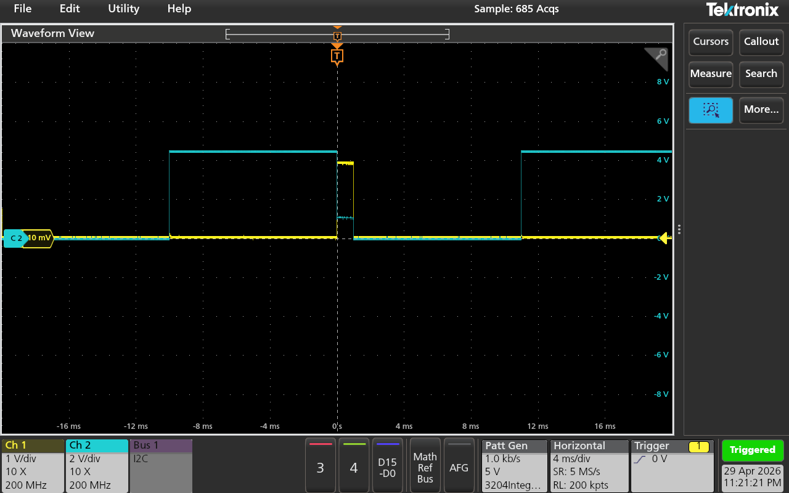
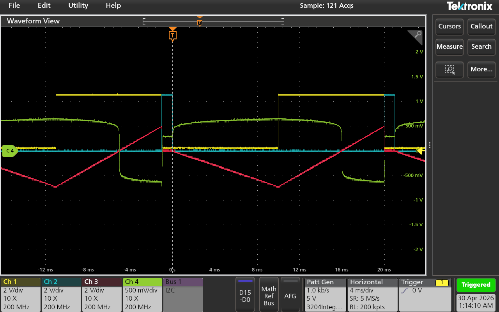
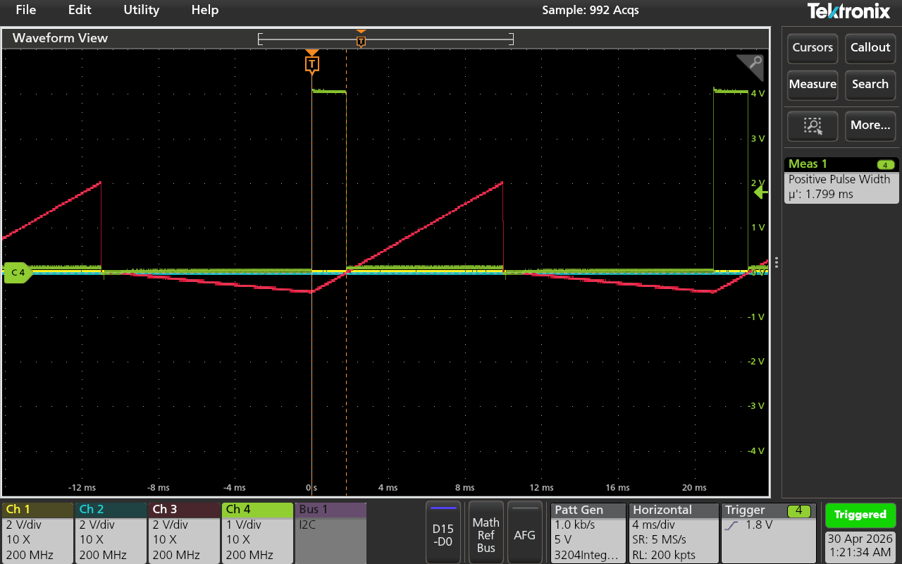
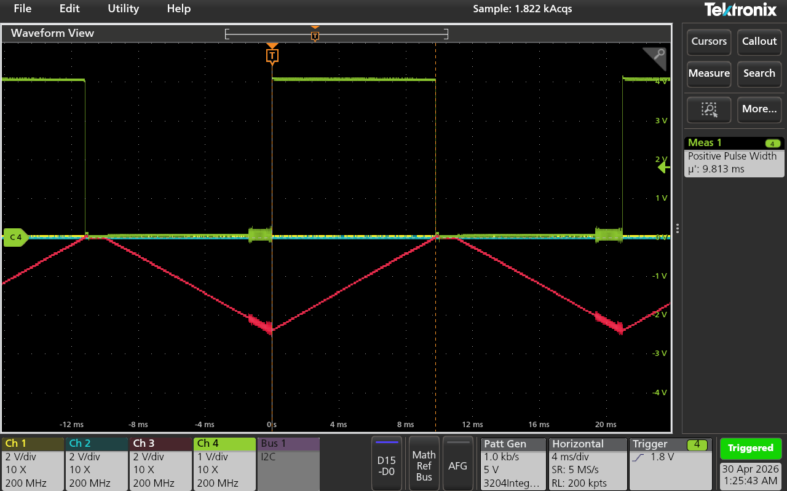

# Integrating Analog-to-Digital Converter

This project implements and characterizes an integrating analog-to-digital converter (ADC) using an op-amp integrator, analog switches, and a comparator. The ADC converts an analog input voltage into a time-based digital measurement by relating the input voltage to the width of an output pulse.

## Project Overview

The circuit was built around a dual-slope ADC concept. During operation, the integrator is first reset to 0 V. The circuit then integrates the input voltage for a fixed time interval before switching to a known reference voltage. The output ramps back toward zero, and an LM311 comparator detects the zero-crossing point. The resulting pulse width is proportional to the original input voltage.

## Key Skills Demonstrated

- Mixed-signal circuit analysis
- Integrating ADC operation
- Op-amp integrator design
- Comparator-based zero-crossing detection
- Analog switch timing control
- Oscilloscope waveform measurement
- ADC transfer characteristic analysis
- Linearity and error analysis
- Technical documentation

## Tools and Components

- LMC6484 op-amp
- LM311 comparator
- 74HC4053 triple 2:1 analog switch
- Oscilloscope
- Digital multimeter
- Function generator
- DC power supply

## Circuit Blocks

The ADC was organized into four main blocks:

1. **Input switching stage**  
   A 74HC4053 analog switch selects between the input voltage and a known reference voltage.

2. **Integrator stage**  
   An LMC6484 op-amp, 100 kΩ resistor, and 0.1 µF capacitor form the integrating stage.

3. **Preamplifier / clamp stage**  
   Diodes clamp the preamplifier output to reduce large voltage swings and avoid slew-rate issues.

4. **Comparator output stage**  
   An LM311 comparator detects when the integrator output crosses zero and produces the output pulse.

## Oscilloscope Results

### Reset and Timing Waveform

This waveform shows the ADC timing sequence, including reset and integration control behavior.

### Dual-Slope ADC Operation

This waveform shows the integrator ramp behavior during input integration and reference integration.

### Pulse Width Measurement

This measurement shows a VPULSE width of approximately 1.799 ms.

This measurement shows a VPULSE width of approximately 9.813 ms near the high end of the measured input range.

## Key Results

- Verified the reset, input integration, and reference integration timing sequence.
- Observed dual-slope ADC behavior on the oscilloscope.
- Measured pulse width as a function of input voltage.
- Found a strong linear relationship between input voltage and pulse width.
- Measured a transfer curve slope of approximately 2.0053 ms/V, close to the ideal 2 ms/V.
- Evaluated ADC error and linearity across the measured input range.

## Full Writeup

[View the full PDF writeup](writeup/ECE_3204_Lab_7_Integrating_ADC.pdf)

## Contributors

- Teremun Beard
- Perry Flagg

## Repository Maintainer

Teremun Beard  
Electrical and Computer Engineering  
Worcester Polytechnic Institute
